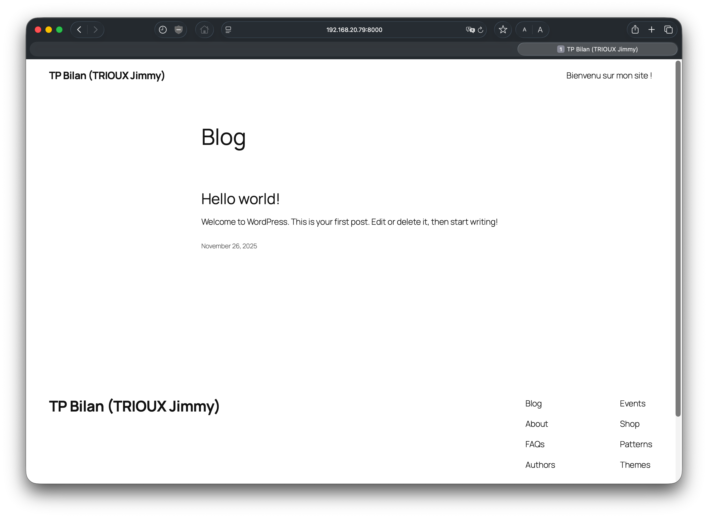

<center><h1>TP Bilan (TRIOUX Jimmy)</h1></center>


- - - 

<h2>Contexte</h2>

Sur cette page, vous pourrez retrouver un script d'installation de Docker et Docker-Compose ainsi que les fichiers docker-compose permettant de générer rapidement deux services : <b>Wordpress</b> et <b>Zabbix</b>.

- - -

<h2>Étape 1 : Création du script d'installation</h2>

<p>
  Le script a été généré entièrement par moi-même, voici le code source :
</p>

```bash
#!/bin/bash

# Si erreur DPKG alors
dpkg --configure -a

# Mise à jour des dépendances, des paquets et création du répertoire keyrings
apt update && apt upgrade -y
apt install ca-certificates curl gnupg lsb-release -y
mkdir -p /etc/apt/keyrings

# Ajout de la clé de signature Docker
curl -fsSL https://download.docker.com/linux/debian/gpg | gpg --dearmor -o /etc/apt/keyrings/docker.gpg
chmod a+r /etc/apt/keyrings/docker.gpg

# Ajout du dépôt officiel de Docker
echo \
  "deb [arch=$(dpkg --print-architecture) signed-by=/etc/apt/keyrings/docker.gpg] https://download.docker.com/linux/debian \
  $(. /etc/os-release && echo "$VERSION_CODENAME") stable" \
  | tee /etc/apt/sources.list.d/docker.list > /dev/null

apt update

# Installation de Docker et Docker-Compose
apt install docker-ce docker-ce-cli containerd.io docker-buildx-plugin docker-compose-plugin -y

# Activation automatique de Docker au démarrage
systemctl enable docker --now

# Affichage du statut de Docker
systemctl status docker
```

- - -

<h2>Étape 2 : Mise en service d'un Wordpress</h2>

<p>
  Nous créerons dans un premier temps le répertoire correspondant, et à l'intérieur de celui-ci nous irons créer un fichier <b>docker-compose.yml</b>.
</p>

```bash
root@groupe4:~/ mkdir ~/wordpress && cd ~/wordpress
root@groupe4:~/ nano docker-compose.yml
```

<p>
  À l'intérieur du fichier docker-compose, tapez ce fichier de configuration. (<b>Source</b> : <a href="https://help.ovhcloud.com/csm/fr-vps-install-wordpress-docker?id=kb_article_view&sysparm_article=KB0062053">OVH</a>)<br>
</p>

```bash
version: '3.8'

services:
  db:
    image: mysql:5.7
    volumes:
      - db_data:/var/lib/mysql
    environment:
      MYSQL_ROOT_PASSWORD: wordpress
      MYSQL_DATABASE: wordpress
      MYSQL_USER: wordpress
      MYSQL_PASSWORD: wordpress

  wordpress:
    depends_on:
      - db
    image: wordpress:latest
    ports:
      - "8000:80"
    environment:
      WORDPRESS_DB_HOST: db:3306
      WORDPRESS_DB_USER: wordpress
      WORDPRESS_DB_PASSWORD: wordpress
    volumes:
      - wordpress_data:/var/www/html

volumes:
  db_data: {}
  wordpress_data: {}
```

<p>
  Ensuite, après avoir enregistrer votre fichier, tapez la commande "docker-compose up -d", cette commande démarre le conteneurs que nous avons définis dans le <b>docker-compose</b>.
</p>

```bash
root@groupe4:~/wordpress# docker-compose up -d
root@groupe4:~/wordpress# docker run --rm wordpress:latest php -v
```
<p>
  Il ne reste plus qu'à se connecter sur l'adresse suivante : <b>http://votre-ip:8000</b> <br>
  Sur la page, configurez le setup du Wordpress et connectez-vous.
</p>

<center></center>

- - - 

<h2>Étape 3 : Mise en service d'un Zabbix</h2>

<p>
  Comme pour Wordpress, nous créerons également un autre répertoire pour accueillir le docker-compose de Zabbix.
</p>

```bash
root@groupe4:~/ mkdir ~/zabbix && cd ~/zabbix
root@groupe4:~/ nano docker-compose.yml
```

<p>
  À l'intérieur du fichier, copiez collez ce fichier de configuration comprenant tous les services nécessaires à l'exécution de Zabbix.
</p>

```bash
version: "3.8"

services:
  postgres:
    image: postgres:15-alpine
    container_name: zabbix-postgres
    restart: unless-stopped
    environment:
      POSTGRES_USER: zabbix
      POSTGRES_PASSWORD: zabbixpwd
      POSTGRES_DB: zabbix
      TZ: Europe/Paris
    volumes:
      - pg_data:/var/lib/postgresql/data

  zabbix-server:
    image: zabbix/zabbix-server-pgsql:ubuntu-7.0-latest
    container_name: zabbix-server
    depends_on:
      - postgres
    restart: unless-stopped
    environment:
      DB_SERVER_HOST: postgres
      POSTGRES_USER: zabbix
      POSTGRES_PASSWORD: zabbixpwd
      POSTGRES_DB: zabbix
      ZBX_DEBUGLEVEL: 3
      TZ: Europe/Paris
    ports:
      - "10051:10051"
    volumes:
      - zbx_alertscripts:/usr/lib/zabbix/alertscripts
      - zbx_external:/usr/lib/zabbix/externalscripts

  zabbix-web:
    image: zabbix/zabbix-web-nginx-pgsql:ubuntu-7.0-latest
    container_name: zabbix-web
    depends_on:
      - zabbix-server
      - postgres
    restart: unless-stopped
    environment:
      DB_SERVER_HOST: postgres
      POSTGRES_USER: zabbix
      POSTGRES_PASSWORD: zabbixpwd
      POSTGRES_DB: zabbix
      ZBX_SERVER_HOST: zabbix-server
      PHP_TZ: Europe/Paris
    ports:
      - "8080:8080"  # accès via http://votre-ip:8080

  zabbix-agent2:
    image: zabbix/zabbix-agent2:ubuntu-7.0-latest
    container_name: zabbix-agent2
    restart: unless-stopped
    environment:
      ZBX_SERVER_HOST: zabbix-server
      ZBX_HOSTNAME: zabbix-agent-local
      TZ: Europe/Paris
    depends_on:
      - zabbix-server

volumes:
  pg_data:
  zbx_alertscripts:
  zbx_external:
```

<p>
  On exécute la commande <b>docker-compose.yml</b> : 
</p>

```bash
root@groupe4:~/zabbix# docker-compose up -d
```

<p>
  Il ne reste plus qu'à se connecter sur l'adresse suivante : <b>http://votre-ip:8080</b> <br>
  Sur la page, connectez-vous avec les identifiants par défaut (Admin / zabbix).
</p>


- - - 

<h2>Étape 4 : Clôner un dépot distant vers sa VM</h2>

<p>
  
</p>

```bash
root@groupe4:~# 
```
